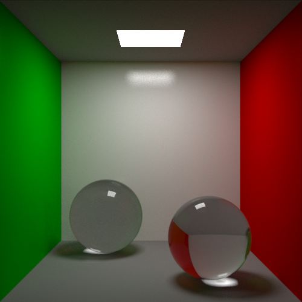

# xtrem-raytracer



## Compiler le projet

Le `Makefile` fourni permet d'utiliser les commandes :

* `make` ou `make debug` pour compiler le projet rapidement sans optimisations.
  Cette commande compile un fichier `main` (ou `main.exe`)
* `make` ou `make release` pour compiler le projet plus lentement mais avec 
  optimisations. Cette commande compile un fichier `xtrem-raytracer` 
  (ou `xtrem-raytracer.exe`)
* `make run` pour exécuter le projet en mode `debug`
* `make benchmark` pour exécuter le projet en mode `release`
* `make clean` pour effacer les exécutables et les artéfacts de compilation

Pour exécuter le programme avec un fichier `test.json`, entrez la commande

```bash
./xtrem-raytracer ./test.json
```

ou sous Windows

```powershell
.\xtrem-raytracer.exe .\test.json
```

4 fichiers image sont créés :

* `image.png` contient l'image finale, filtrée
* `unfiltered_image.png` contient l'image non filtrée
* `variance0.png` et `variance1.png` contiennent les deux half-buffers de variance
  créés pendant l'exécution

## Compilateur

Le compilateur utilisé est 
[`clang`](https://github.com/llvm/llvm-project/releases/tag/llvmorg-13.0.0).

**ATTENTION:** Il est nécéssaire d'utiliser la dernière version de `clang` 
(clang-13). Les versions antérieures ne fonctionnent pas.
